# Omniwatch for iTerm2

<picture>
  <source media="(prefers-color-scheme: dark)" srcset="docs/screenshots/split-dark.png">
  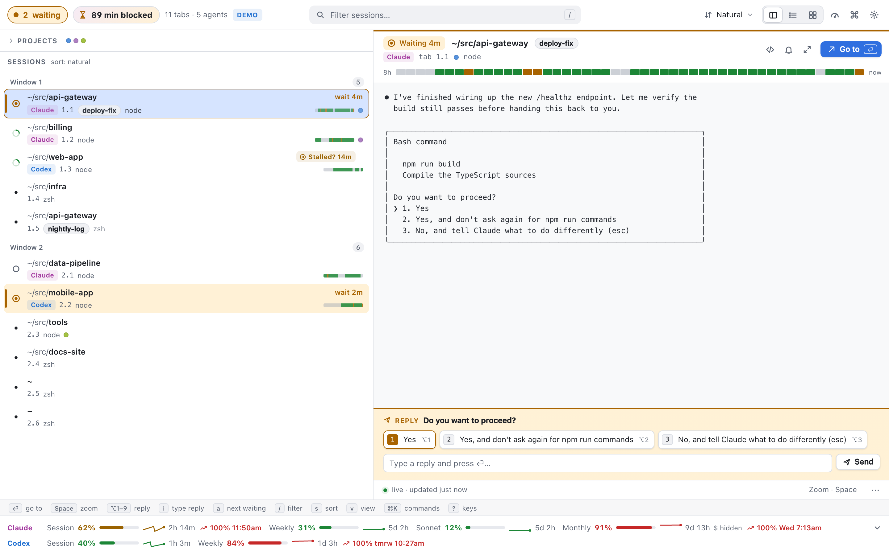
</picture>

Omniwatch is the successor to [Ultrawatch for iTerm2](https://github.com/burnsbert/ultrawatch-for-iterm2),
rebuilt as a native macOS app that runs in its own window instead of inside iTerm2. If you're running 5–20
Claude Code / Codex agents across projects, the time you lose isn't running
them — it's the time they sit **blocked on you**, and the context-switching
cost of finding out what each one wants. Omniwatch answers the question —
**who needs me right now, and what are they doing?** — in a native Mac window,
with a menu-bar counter and notifications, without taking up an iTerm2 tab.

## Feature tour

**Everything you need to watch your agents**, in GUI form: live preview of any session's
screen without switching tabs, busy/waiting/idle classification for Claude
Code and Codex, attention routing (row flash, toast, sound), a usage-limits
strip for Claude and Codex rolling windows, fuzzy filter, five sort orders,
persistent labels, a five-slot color-coded Projects panel, and full keyboard
parity (see [Keys](#keys)) plus mouse support.

- **Native window, menu-bar counter, dock badge** — glanceable "who needs
  me" without opening a tab. The window title, dock badge, and a
  `NSStatusItem` (`◉ N` in amber) all show the waiting count; a status-item
  dropdown lists waiting sessions, longest wait first.
- **Native notifications with actions** — a session flipping to `waiting`
  posts a notification titled "*title* needs you" with the prompt's
  question as the body and **Go to session** / **Show in Omniwatch**
  actions, suppressed while that session is already visible or muted.
- **Quick reply** — the prompt's own options (`❯ 1. Yes`, `2. Yes, and
  don't ask again…`, Codex `Yes (y)`) become buttons in the preview, with
  `⌥1`–`⌥9` and a free-text field. It's guarded: only for agent sessions
  currently `waiting`, and the request must match the screen it was based
  on, or it's rejected rather than typed into a stale prompt.
  <picture><source media="(prefers-color-scheme: dark)" srcset="docs/screenshots/quick-reply-dark.png">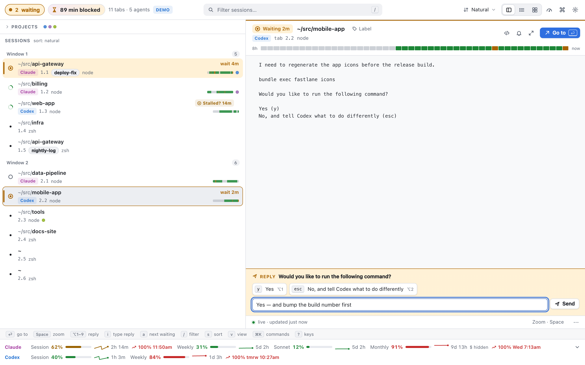</picture>
- **"Blocked on you" stats** — a toolbar chip and card showing today's
  total agent-minutes spent waiting, the longest single wait, and how many
  prompts you've answered — the cost of attention, made visible.
  <picture><source media="(prefers-color-scheme: dark)" srcset="docs/screenshots/stats-dark.png">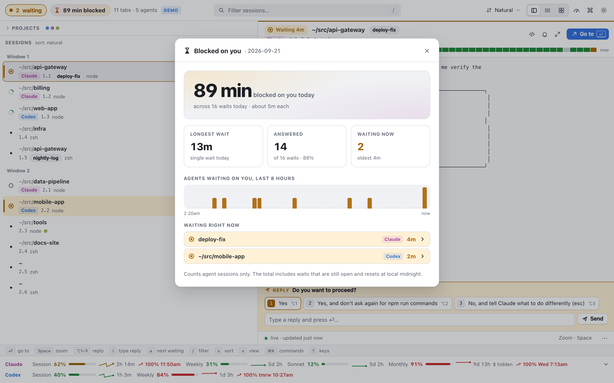</picture>
- **Activity timeline** — a busy/waiting/idle ribbon per session covering
  the last 8 hours, in the preview header and in a per-session history
  sheet (`t`), so you can see at a glance which agent has been stuck, and
  for how long.
  <picture><source media="(prefers-color-scheme: dark)" srcset="docs/screenshots/timeline-dark.png">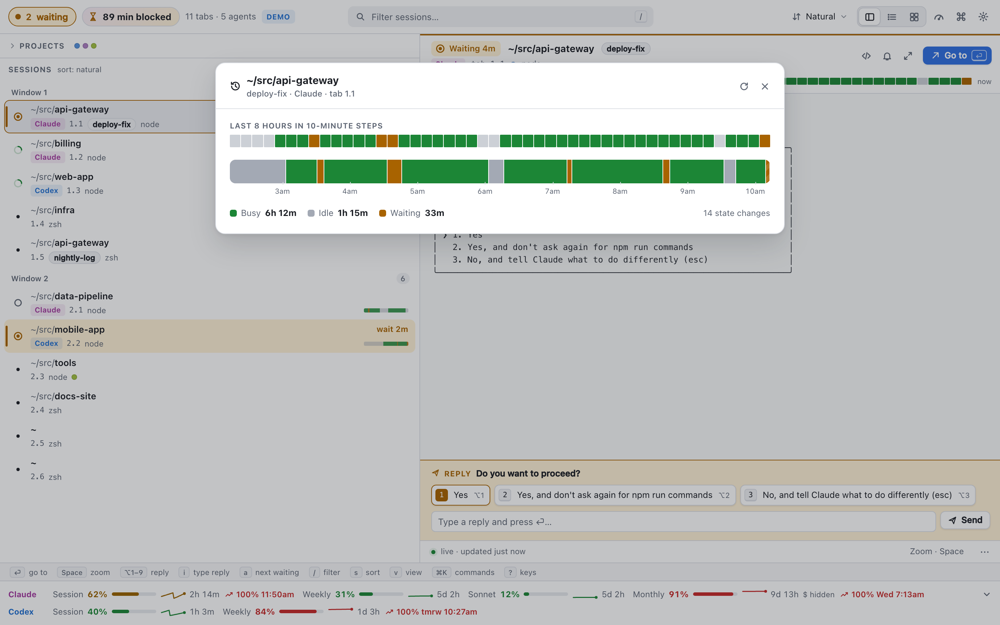</picture>
- **Stall detection** — a session that's been busy with an unchanged
  screen for more than `stall_minutes` (default 10, configurable, 0 = off)
  gets a "may be stalled?" chip and, optionally, a notification — catches
  hung tools and infinite loops.
- **Usage burn rate** — usage history feeds a sparkline per limit and an
  "at this rate: 100% Today at 11:49am" projection, turning the pace
  warning into a chart.
  <picture><source media="(prefers-color-scheme: dark)" srcset="docs/screenshots/usage-dark.png">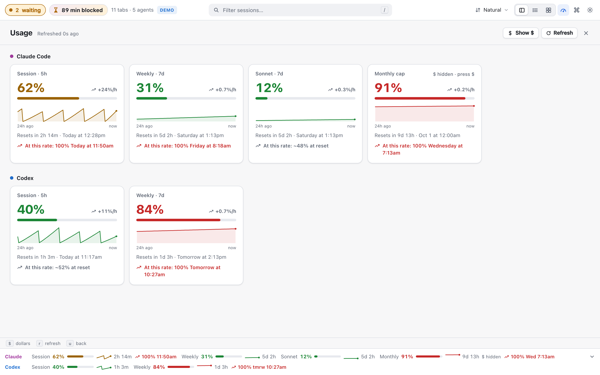</picture>
- **Reveal / Open in…** — jump straight into the repo an agent is editing:
  reveal the session's path in Finder (`o`), open it in your editor (`e`,
  `$VISUAL`/`$EDITOR`/`code` by default), or copy the path (`y`). Resolved
  on the backend from the session, never from anything the client sends.
- **Command palette** (`⌘K`) — fuzzy search over every keyboard action and
  every session, with matched characters highlighted.
  <picture><source media="(prefers-color-scheme: dark)" srcset="docs/screenshots/palette-dark.png">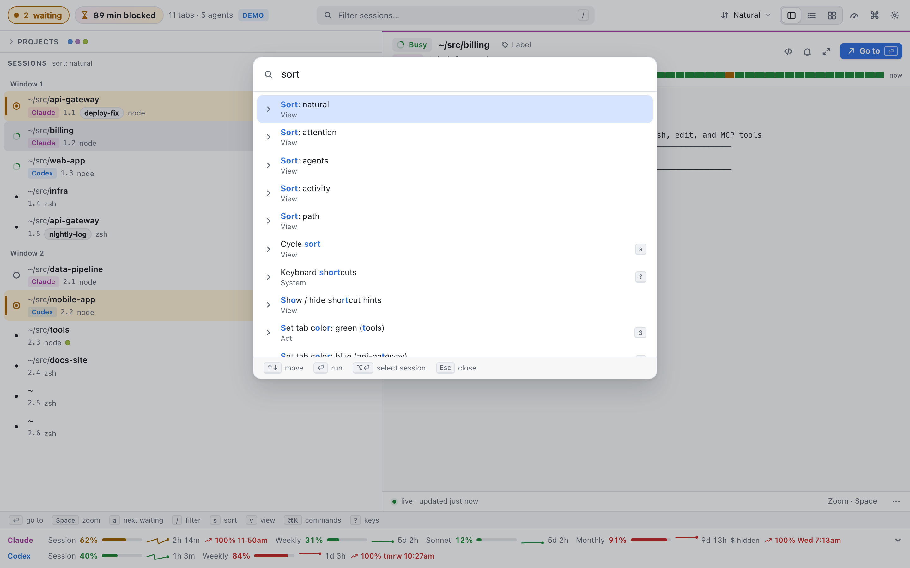</picture>
- **Dark / light / system / high-contrast themes**, adjustable text size,
  reduced-motion support.
- **List, grid, and zoom views** alongside the split default: a
  full-width sortable list, a responsive tile wall (agent sessions by
  default, `A` for all), and a full-screen zoom of any one session.
  <picture><source media="(prefers-color-scheme: dark)" srcset="docs/screenshots/list-dark.png">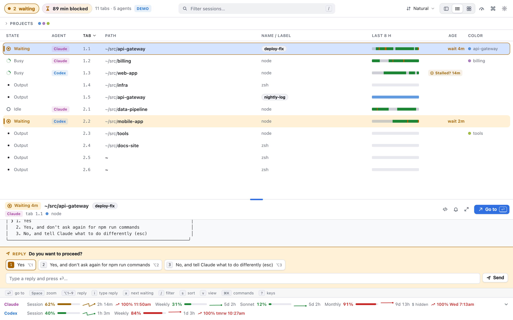</picture>
  <picture><source media="(prefers-color-scheme: dark)" srcset="docs/screenshots/grid-dark.png">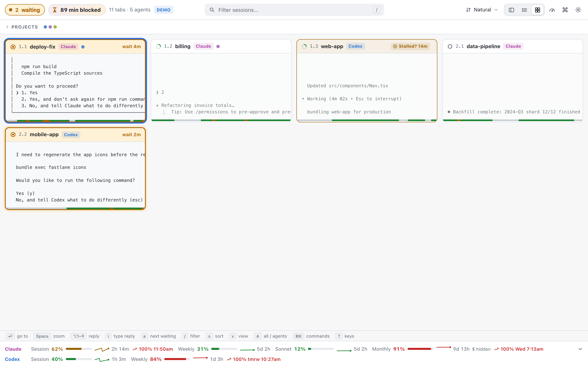</picture>
  <picture><source media="(prefers-color-scheme: dark)" srcset="docs/screenshots/zoom-dark.png">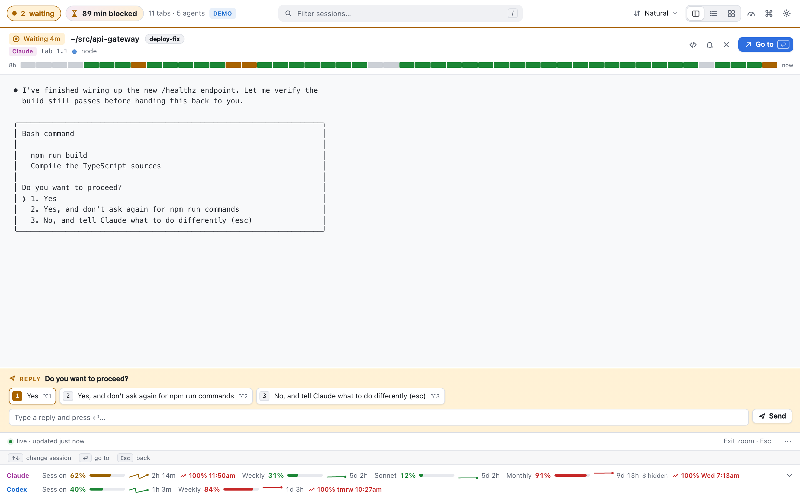</picture>
- **Mute**, **keep window on top**, and a **compact layout** for narrow
  companion windows.
  <picture><source media="(prefers-color-scheme: dark)" srcset="docs/screenshots/compact-dark.png">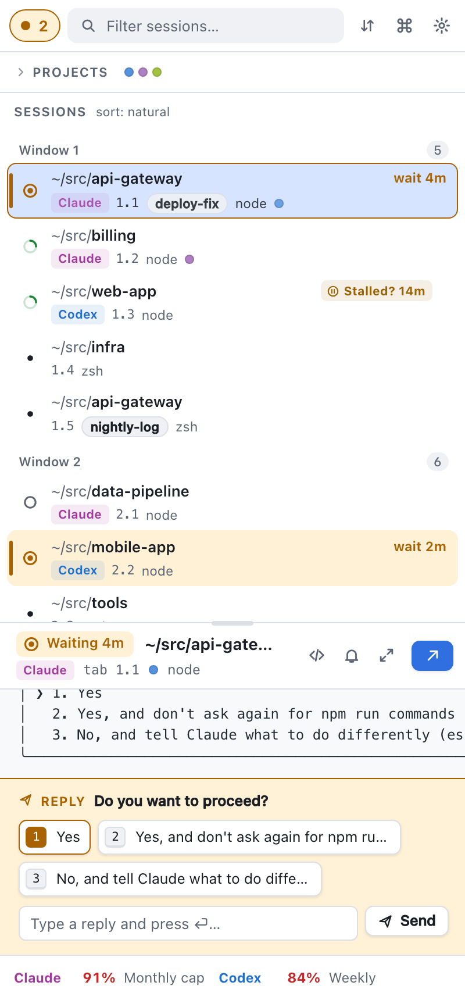</picture>
- **Demo mode** (`omniwatch demo`) — a fully populated, scripted fake
  dashboard with zero setup; the same data drives the tests and the
  screenshots in this README.
- **Launch iTerm2 / permission diagnostics** (`omniwatch doctor`, and a
  first-run onboarding sheet) — removes the top two "it shows nothing"
  problems: iTerm2 not running, and the Automation permission not granted.
  <picture><source media="(prefers-color-scheme: dark)" srcset="docs/screenshots/onboarding-dark.png">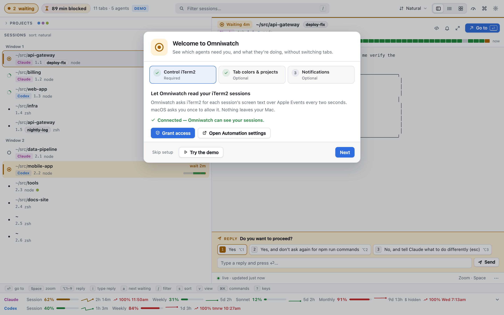</picture>
  <picture><source media="(prefers-color-scheme: dark)" srcset="docs/screenshots/empty-not-running-dark.png">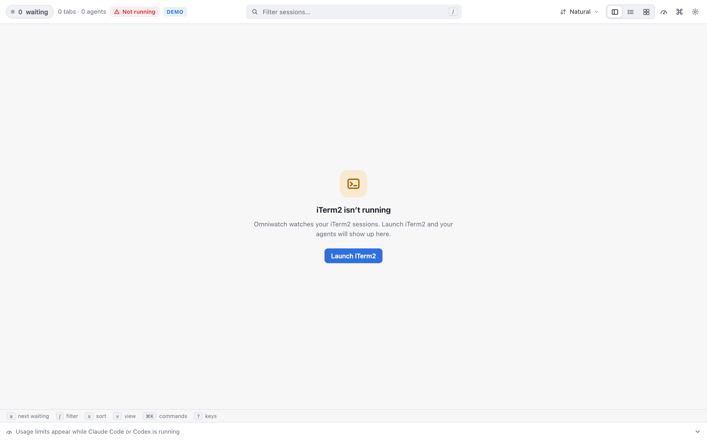</picture>
- **Ultrawatch migration** — existing Ultrawatch users keep their labels,
  projects, and prefs on first run (see [Migrating from Ultrawatch](#migrating-from-ultrawatch)).
- **Projects panel** — five numbered, color-coded project slots; `1`–`5`
  tags the selected session's iTerm2 tab color to a project, `0` clears it.
  <picture><source media="(prefers-color-scheme: dark)" srcset="docs/screenshots/projects-dark.png">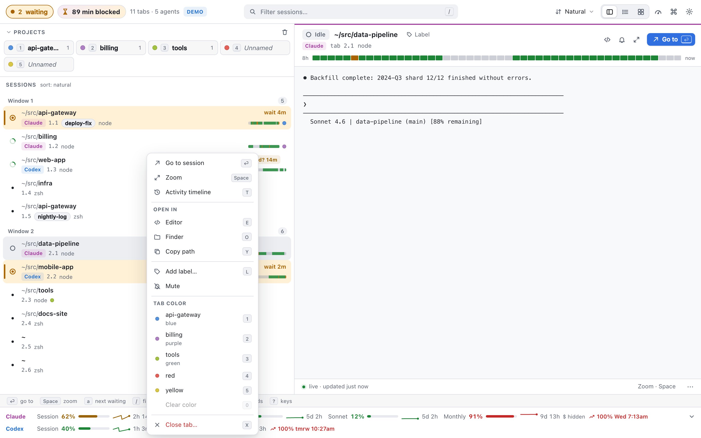</picture>
- **Settings** (`⌘,`) for theme, text size, notifications, sound, quick
  reply, stall minutes, editor command, keep-on-top, launch at login, and
  menu-bar-only mode.
  <picture><source media="(prefers-color-scheme: dark)" srcset="docs/screenshots/settings-dark.png">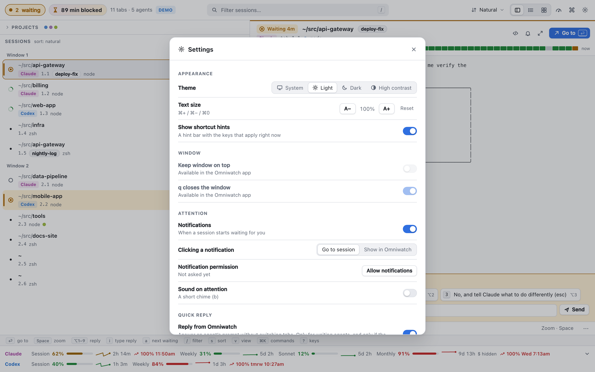</picture>

See [`docs/USER_GUIDE.md`](docs/USER_GUIDE.md) for every view and feature in
detail, and [`docs/DESIGN.md`](docs/DESIGN.md) for the full design.

## Install

One command, no sudo:

```bash
git clone https://github.com/burnsbert/omniwatch-for-iterm2 && cd omniwatch-for-iterm2 && ./install.sh
```

This builds `dist/omniwatch` (a self-contained Python zipapp) and
`Omniwatch.app` (built locally with `swiftc`, ad-hoc signed), installs the
app to `~/Applications`, and installs an `omniwatch` shim to `~/.local/bin`.
It's idempotent — safe to run again to update. `./install.sh --help`:

```
$ ./install.sh --help
Omniwatch installer (docs/DESIGN.md §6 "Install"). One command, no sudo:

  git clone https://github.com/burnsbert/omniwatch-for-iterm2 && \
    cd omniwatch-for-iterm2 && ./install.sh

Usage: install.sh [--prefix DIR] [--no-app] [--with-colors]
                   [--with-plugin] [--no-open]

  --prefix DIR    install under DIR instead of $HOME (DIR/Applications,
                  DIR/.local/bin, DIR/.local/share/omniwatch) — used by
                  `make check-install` so nothing touches the real
                  ~/Applications or ~/.local/bin.
  --no-app        skip building/installing Omniwatch.app; browser-only
                  mode (`omniwatch --browser`). Automatic if `swiftc`
                  isn't found.
  --with-colors   also `pip install iterm2` for the tab-color feature
                  (network install; opt-in, never run in automated
                  tests — see Makefile's check-install).
  --with-plugin   also install the iTerm2 status-bar plugin (WP10,
                  docs/DESIGN.md §4.8) into
                  DIR-or-$HOME/Library/Application Support/iTerm2/
                  Scripts/AutoLaunch — opt-in; never run in automated
                  tests without --prefix.
  --no-open       don't open the app / run anything after installing.
                  Always passed in automated tests/CI.

Idempotent: safe to run more than once (each run replaces its own
previous output rather than erroring or duplicating anything).
```

### Requirements

- macOS
- [iTerm2](https://iterm2.com)
- Python 3.9+ (standard library only — nothing to `pip install` for the
  backend itself)
- Xcode Command Line Tools (`swiftc`) to build the native app; without it
  `install.sh` falls back to `--no-app` (browser-only) automatically

### Uninstall

```bash
./uninstall.sh [--prefix DIR] [--purge]
```

Removes the app, the shim, and the zipapp. Config (labels, prefs, projects)
is left in place unless you pass `--purge`, which also removes logs.

## First-run permissions

1. **Control iTerm2 (required).** Omniwatch drives iTerm2 through
   AppleScript, which needs Automation access. The first-run onboarding
   sheet's **Grant access** button (or `omniwatch doctor`) triggers the
   macOS prompt. If you ever see "iTerm2 query failed" or a permission
   card, see [Troubleshooting](docs/TROUBLESHOOTING.md#automation-denied).
2. **Tab colors & Projects color-assignment (optional).** iTerm2's
   AppleScript API can't read or set tab colors — that needs iTerm2's
   separate Python API:
   ```bash
   make install-colors          # or: ./install.sh --with-colors
   ```
   Then in iTerm2: **Settings → General → Magic → Enable Python API.**
   Without this, Omniwatch runs exactly the same, minus the colored dot
   and the `1`–`5`/`0` tab-color keys (which toast "tab colors
   unavailable" instead).
3. **Notifications (app mode).** Requested the first time a session
   transitions to waiting, or from Settings. In browser mode, this is the
   browser's own Notification permission instead.

## Demo mode

```bash
omniwatch demo
```

Runs the backend against a scripted fake iTerm2/usage world — no real
iTerm2, network, or Keychain access — and opens it in your browser. It's a
fully populated dashboard: multiple windows, Claude and Codex sessions in
every state (including one waiting on a permission prompt and one
stalled), 8 hours of activity history, "blocked on you" stats, and usage
history with a burn-rate projection. It's the same data this README's
screenshots and the test suite use.

## Keys

Bare keys apply when focus isn't in a text field (typing in the filter or a
label doesn't trigger them). This table is generated from
[`omniwatch/web/js/commands.js`](omniwatch/web/js/commands.js) and
[`keymap.js`](omniwatch/web/js/keymap.js) — the single source shared by the
shortcut sheet (`?`), the command palette (`⌘K`), and this README — by
[`scripts/gen-keys-md.mjs`](scripts/gen-keys-md.mjs).

<!-- keys:start -->

**Navigate**

| Key | Action |
|-----|--------|
| ↑ / k | Move selection up |
| ↓ / j | Move selection down |
| ← | Move selection left (grid) |
| → | Move selection right (grid) |
| ⏎ / g / G | Go to session |
| a | Select next waiting session |
| Tab | Cycle focus region forward |
| ⇧Tab | Cycle focus region backward |

**Act**

| Key | Action |
|-----|--------|
| Space | Zoom selection |
| l / L | Edit label |
| 1–5 | Set tab color: project N |
| 0 | Clear tab color |
| c / C | Clear all projects |
| n / N | New iTerm2 tab |
| x / X | Close tab |
| i | Focus reply field |
| ⌥1–⌥9 | Send reply option N |
| r / R / ⌘r | Refresh |
| e / E | Open in editor |
| o / O | Reveal in Finder |
| y / Y | Copy path |

**View**

| Key | Action |
|-----|--------|
| t / T | Activity timeline (8 h) |
| v / V | Cycle view |
| ⌘1 | View: split |
| ⌘2 | View: list |
| ⌘3 | View: grid |
| > / . | Grow split (sidebar wider) |
| < / , | Shrink split (sidebar narrower) |
| / / ⌘f | Filter sessions |
| s / S | Cycle sort |
| p / P | Toggle projects panel |
| $ | Toggle dollar amounts |
| b / B | Toggle sound on attention |
| A | Grid: all sessions / agents only |
| u / U / ⌘u | Toggle usage view |
| ⌘+ / ⌘= | Increase text size |
| ⌘- | Decrease text size |
| ⌘0 | Reset text size |

**System**

| Key | Action |
|-----|--------|
| Esc | Cancel / close top overlay |
| q | Close window |
| ⌘k | Command palette |
| ⌘, | Settings |
| ? / ⌘/ | Keyboard shortcuts |

_Native app only (not in the web keymap, so it works even when the window is
hidden): a global hotkey — default **⌃⌥⌘O** — shows or hides Omniwatch; a second,
off-by-default hotkey goes to the next waiting session in iTerm2 without switching to
it. **⌘Q** quits the app._

<!-- keys:end -->

## Migrating from Ultrawatch

On first run, if Omniwatch has no state of its own yet and
`~/.config/ultrawatch/state.json` exists, Omniwatch imports your labels,
projects, `projects_open`, view, sort, `show_dollars`, `split_ratio`, and
`bell` (renamed `sound`) from it. The Ultrawatch file is read-only — never
written — so running both remains safe, and the import happens at most
once (recorded as `migrated_from_ultrawatch` in Omniwatch's own
`state.json`).

## The iTerm2 plugin

An optional status-bar component for people who still want a glance inside
iTerm2 itself:

```bash
make install-plugin          # or: ./install.sh --with-plugin
```

Installs into `~/Library/Application Support/iTerm2/Scripts/AutoLaunch`.
Enable **iTerm2 → Settings → General → Magic → Enable Python API**, then
right-click a status bar → **Configure Status Bar** → add **Omniwatch**. It
shows `◉ N waiting` (hidden at 0), or "Omniwatch off" with a click that
launches Omniwatch if there's no backend running; clicking it otherwise
goes to the longest-waiting session. It also pushes iTerm2 focus changes
to the backend, so switching to a waiting session in iTerm2 itself clears
its attention immediately.

## How it works

A small Swift/AppKit shell (`Omniwatch.app`) spawns and supervises a
stdlib-only Python backend (`omniwatch serve`) bound to `127.0.0.1` on a
random port with a per-launch token. The backend polls iTerm2 with one
batched AppleScript call every 2 seconds, classifies Claude Code and Codex
sessions by reading their screen contents, and serves a small web UI over
HTTP + Server-Sent Events. The
shell's `WKWebView` loads that UI and also runs its own SSE client to
drive the menu bar, dock badge, and notifications whether or not the
window is visible. `omniwatch --browser` runs the identical backend and
opens the same UI in your default browser instead of the native shell.
See [`docs/DESIGN.md`](docs/DESIGN.md) for the full architecture and
[`docs/API.md`](docs/API.md) for the HTTP/SSE contract.

## Development

```bash
make test           # Python unit tests (python3)
make test39         # same, under the Command Line Tools' /usr/bin/python3 (3.9)
make coverage       # Python coverage report (installs on demand: pip install --user coverage)
make web-unit       # web/js unit tests (node --test web-tests/unit/)
make swift-test     # Swift Core logic tests (shell/build.sh test)
make check          # test + py_compile + web-unit
make e2e            # Playwright E2E, chromium + webkit (stub today; fills in with WP6)
make screenshots    # regenerate docs/screenshots/*.png from demo mode (stub today; fills in with WP6)
make check-install  # install.sh into a throwaway prefix; verifies layout + idempotency
node scripts/gen-keys-md.mjs [--check]   # regenerate / verify the Keys table above
```

## License

MIT © Eric Burns — see [`LICENSE`](LICENSE).
